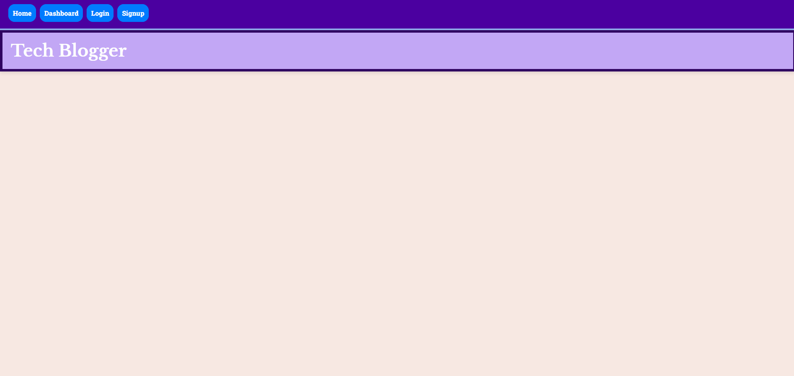

# Project Title
    Tech Blog

## Description
    This is a blogging website were users can create an account login, post edit and delete blog post.
## Installation
    To install make sure to run npm i to install all the dependacies.
## Instructions
    install dependacies, run node server.js file. User can signup using a name, email and password, users can create blog post in the Dashboard tab. Users can view all blog post on the Home tab.
## Usage
    used to let user's blog about thoughts on tech.
## Screenshot

## Test
    N/A
## Credits
    N/A
## License

## How to Contribute
    N/A
## Features
    Create account, login to account, ability for user to edit and delete blog post. ability for users to comment on others blog post
## Questions
https://github.com/RyanPersaud03?tab=repositories
n/a